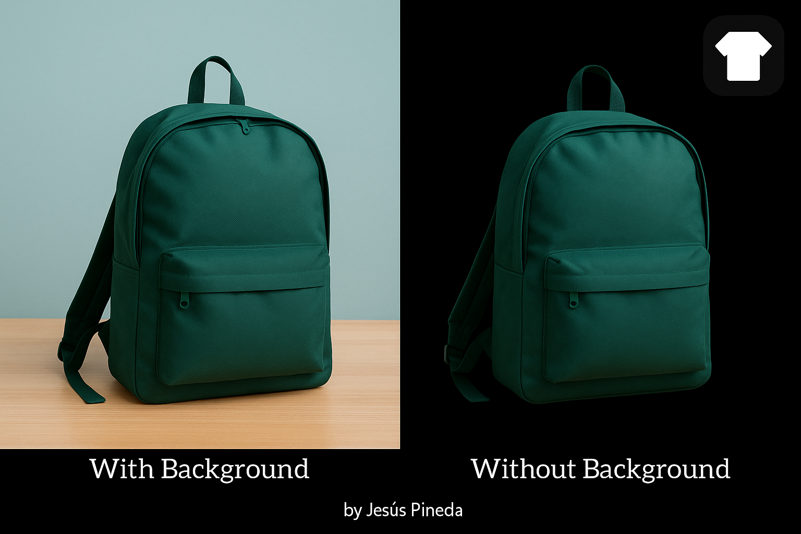

# Eliminar fondo de imagen con IA  

[](LICENSE)  
[](#-contribuciones)  

EFI es una aplicación de código abierto desarrollada en **Python** que permite **eliminar el fondo de imágenes automáticamente**.  
Ideal para diseñadores, creadores de contenido y usuarios que necesiten una edición rápida sin herramientas complejas.  



---

## Características
✅ Carga imágenes desde tu sistema  
✅ Elimina el fondo automáticamente con IA  
✅ Interfaz gráfica simple y fácil de usar  
✅ Multiplataforma (Windows/Linux/MacOS)    
✅ Funciona sin conexión a Internet, una vez descargado el modelo de IA

---

## Requisitos del sistema
- **OS:** Windows / Linux / MacOS  
- **RAM:** 500MB mínimo, 1GB recomendado  
- **GPU:** Opcional  

---

## Instalación

### 🔹 Opción 1 — Binarios
- **Windows:** Descargar el archivo [.exe](https://github.com/jesuspinedaof/efi/releases/download/v1.0/efi.setup.exe)  
- **Linux:** Descargar el `.deb`, `AppImage` o `Flatpak`
- **MacOs:** Se recomienda ***clonar*** el repositorio

### 🔹 Opción 2 — Código fuente
```bash
git clone https://github.com/jesuspinedaof/efi.git
cd removebg-ai
pip install -r requirements.txt
```

---

### Pruebas realizadas
- Imágenes con múltiples objetos en el fondo  
- Carga y procesamiento manual  
- Validación de distintos formatos de imagen  
- Rendimiento con imágenes grandes  


---

### Actualizaciones
Se recomienda usar Git para mantener el proyecto actualizado

Nuevas funciones se publicarán en el repositorio oficial

---

### Despliegue y mantenimiento
- Ejecutable desde terminal  
- Compatible con entornos virtuales  
- Se recomienda mantener actualizado vía Git  

---

## Contribuciones
¡Tus aportes son más que bienvenidos!
Si tiene alguna idea de cómo mejorar esto. Somos todo oído... Cualquier duda o error puede compartir la información. ¿Quieres atribuir u colaborar?, Para informar cualquier de estas:

**Email:** [tornioficial@gmail.com](mailto:tornioficial@gmail.com)  
**WhatsApp:** [+58 416 060 1607](https://wa.me/584160601607)  

---

### 📚 Recursos útiles
[Python Documentación](https://docs.python.org/3/)   
[Python Tkinter docs](https://docs.python.org/es/3/library/tkinter.html)   
[Documentación de rembg](https://github.com/danielgatis/rembg)   
[Guía de PIL](https://pillow.readthedocs.io/en/stable/)   
[OpenCV docs](https://docs.opencv.org/master/index.html)   

---

## Licencia
**MIT**  

© 2025 - Jesús Pineda  
